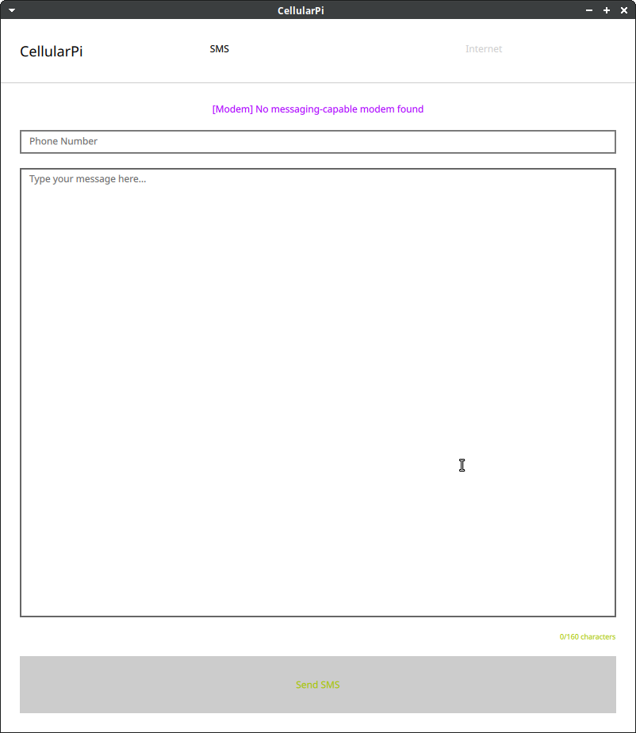
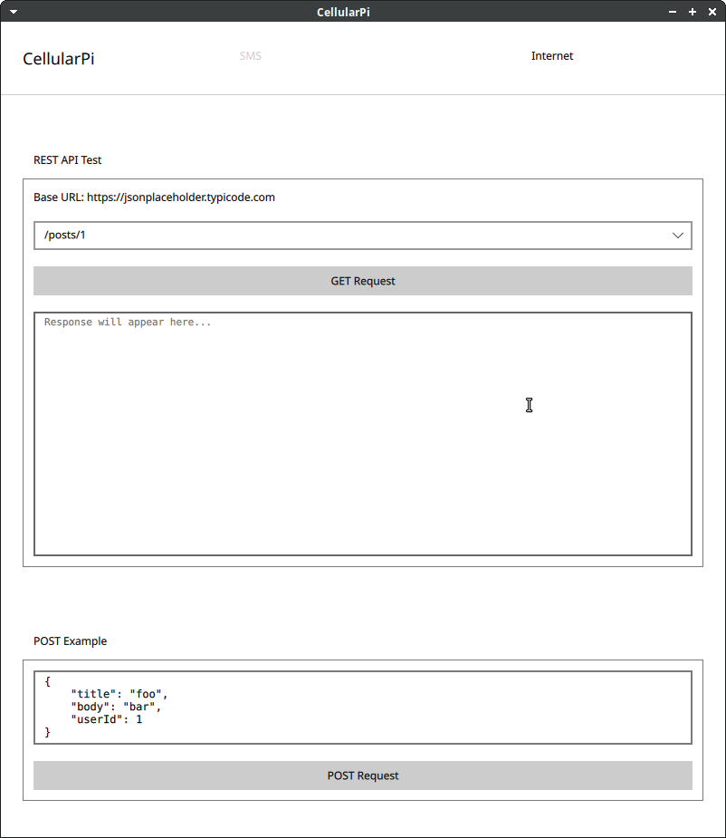
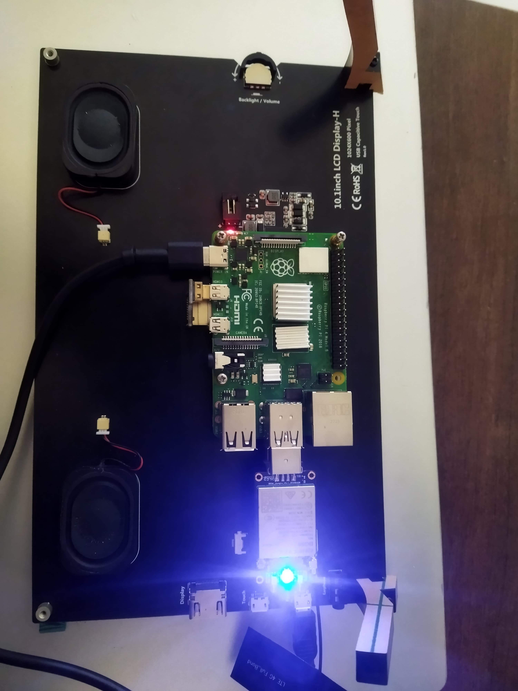

# CellularPi

A modern Qt6-based cellular modem testing interface with SMS capabilities and REST API testing functionality. This application provides a user-friendly GUI for controlling cellular modems and testing internet connectivity on Linux systems.





## Blogs

1. [The Implementation Chronicles: A7670E USB Modem: Part 1](https://squared.co.ke/blog/cellular-connectivity-with-raspberry-pi-4b)
2. [Driver Support for A7670E: Kernel Module Implementation: Part 2](https://squared.co.ke/blog/driver-support-for-a7670e)
3. [Testing A7670E Modem Features with CellularPi: Part 3](https://squared.co.ke/blog/testing-cellular-connectivity-on-pi4b)

## Features

### SMS Management
- Send SMS messages through cellular modem
- Real-time delivery status updates
- Message length tracking and validation
- Queue management for multiple messages
- Automatic retry mechanism
- Error handling and user feedback

### Internet Connectivity
- REST API testing interface
- Support for common HTTP methods (GET, POST, PUT, DELETE)
- JSON request/response visualization
- SSL/TLS support
- Built-in demo API integration

## Requirements

### System Requirements
- Linux-based operating system
- ModemManager service installed and running
- Qt 6.7.0 or later
- CMake 3.16 or later
- C++17 compliant compiler

### Qt Modules Required
- Qt Core
- Qt Quick
- Qt Network
- Qt DBus
- Qt Concurrent

## Project Structure

```
CellularPi/
├── CMakeLists.txt              # Main CMake configuration
├── Modem/                      # Modem management module
│   ├── CMakeLists.txt
│   ├── modem.h/cpp            # Core modem functionality
│   └── modemdbusmanager.h/cpp # D-Bus communication
├── REST/                       # REST client module
│   ├── CMakeLists.txt
│   └── restclient.h/cpp       # REST API functionality
├── Qml/                       # QML interface files
│   ├── CMakeLists.txt
│   └── Main.qml              # Main application window
└── README.md
```

## Cross-Compilation

### Option 1: Native Development on Raspberry Pi

Follow the comprehensive setup guide at [QTonRaspberryPi](https://github.com/learnqtkenya/QTonRaspberryPi) to properly configure your Raspberry Pi for Qt development. This includes:
- Installing required packages
- Setting up Qt development tools
- Configuring the build environment

### Option 2: Cross-compilation for ARM64 (Recommended)

For faster development and build times, we recommend using cross-compilation. Here's how to set it up:

1. Clone the development environment repository:
```bash
git clone https://github.com/learnqtkenya/QTonRaspberryPi.git
cd QTonRaspberryPi
```

2. Clone CellularPi into the project directory:
```bash
rm -rf project && git clone https://github.com/learnqtkenya/CellularPi.git project
```

3. Create a build script (build.sh):
```bash
#!/bin/bash

# Function to run a command and print a warning if it fails
run_command() {
    "$@"
    if [ $? -ne 0 ]; then
        echo "Warning: Command failed: $@"
    fi
}

# Run each command using the run_command function
run_command rm -rf appCellularPi
run_command docker rm tmpbuild
run_command docker build -t qtcrossbuild . 
run_command docker create --name tmpbuild qtcrossbuild
run_command docker cp tmpbuild:/build/project/appCellularPi ./appCellularPi
echo "Build script completed."
```

4. Make the script executable and run it:
```bash
chmod +x build.sh
./build.sh
```

This will create a Docker container with the necessary cross-compilation environment, build CellularPi, and copy the resulting binary to your host machine.

5. Deploy to Raspberry Pi:
```bash
scp appCellularPi pi@raspberrypi:/home/pi/
```

### Build Verification

After deploying to the Raspberry Pi, verify the build:
```bash
# On the Raspberry Pi
chmod +x appCellularPi
./appCellularPi --version
```

### User Interface
- Modern, responsive design
- Universal theme support
- Dynamic scaling for different screen sizes
- Tabbed interface for organized functionality
- Real-time status updates

## Usage

### SMS Functionality
1. Launch the application
2. Enter the recipient's phone number in international format (e.g., +1234567890)
3. Type your message (160 characters max)
4. Click "Send SMS" to transmit

### REST API Testing
1. Switch to the "Internet" tab
2. Select an endpoint from the dropdown or enter a custom one
3. Use the GET/POST buttons to make requests
4. View formatted responses in the response area
5. Test custom APIs by modifying the base URL

## Technical Details

### Modem Integration
- Uses ModemManager's D-Bus interface
- Asynchronous message handling
- Queued message processing
- Automatic retry mechanism for failed messages

### REST Client Features
- Based on Qt 6.7's new REST client features
- Support for modern REST APIs
- JSON parsing and formatting
- Error handling and retry logic
- SSL/TLS certificate handling

### Architecture
- Modular design with separate components for modem and REST functionality
- QML for the user interface
- C++ for core functionality
- Event-driven communication between components

## Contributing

1. Fork the repository
2. Create a feature branch
3. Make your changes
4. Submit a pull request

Please follow our coding style and include appropriate tests.

## License

This project is licensed under the MIT License - see the LICENSE file for details.

## Acknowledgments

- Qt Company for Qt 6.7 and the REST client features
- ModemManager team for the D-Bus interface
- JSONPlaceholder for the demo API
